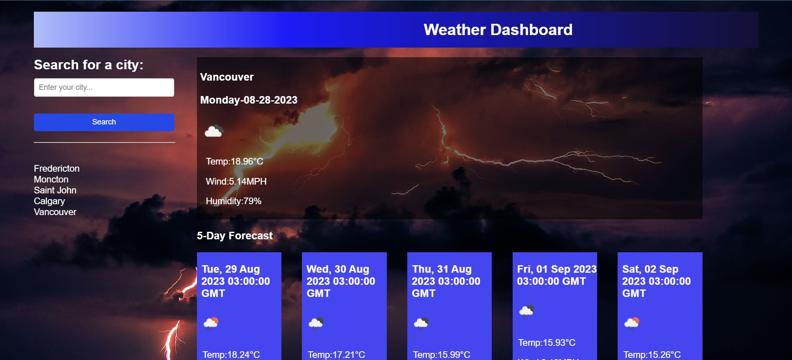

# Lightning Weather Dashboard

## Description

This weather dashboard application allows you to search for current and future weather conditions for any city.

## Table of Contents

- [Installation](#installation)
- [Usage](#usage)
- [Screenshots](#Screenshots)
- [Credits](#credits)
- [Tests](#tests)
- [License](#license)
- [Future-Development](#Future-Development)

## Installation

N/A

## Usage

When you search for a city by name, you are presented with the city's name, date, icon, temperature, humidity and wind speed for that city's current weather, along with a 5 day forecast. Then your searched city is saved to local storage.

This app is deployed to Github:
(https://github.com/)

## Screenshots

## Credits

Background image by Alexander Grigorian

## Tests

N/A

## License

N/A

## Future-Development

Add functions to display weather for search history. Add a clear search function. This project is part of a coding bootcamp and I am out of time. I need to move on.
